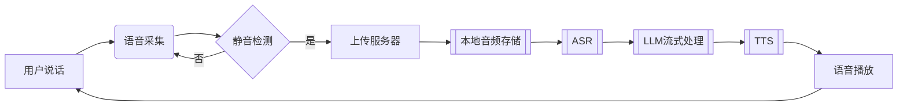

# CharacterVerse-AI

## Explanation
该项目为七牛云比赛项目，议题二。

## 后端项目启动 && 后端数据流图

## 📂 项目结构

```text
Backend-CharacterVerse/
├── api/            # API层
├── config/         # 配置加载
├── database/       # 数据库初始化
├── middleware/     # 中间件
├── model/          # 数据模型
├── router/         # 路由配置
├── service/        # 业务逻辑层
├── utils/          # 工具库
├── main.go         # 入口文件
└── go.mod          # 依赖管理
```
语音通话数据流（最终版）：



基于Go语言开发的AI角色对话平台后端服务，提供用户管理、角色对话、语音交互等核心功能。

## 🚀 功能特性

- RESTful API 设计
- JWT鉴权与CORS支持
- 语音合成（TTS）与语音识别（ASR）服务
- 支持MySQL/PostgreSQL数据库
- 多部署方案支持（本地/Docker）

## 📦 环境要求

- Go 1.21+
- MySQL 5.7+ 或 PostgreSQL 12+
- Redis
- Docker 20.10+（可选）

## ⚡ 快速开始

```bash
# 克隆项目
git clone xxx
cd Backend-CharacterVerse

# 安装依赖
go mod tidy

# 启动服务（开发模式）
go run main.go
```


服务器后端部署
Docker Compose部署

```yaml
version: '3.8'

services:
  mysql:
    image: mysql:8.0
    container_name: mysql8-prod
    environment:
      MYSQL_ROOT_PASSWORD: ${DB_ROOT_PASSWORD}
      MYSQL_DATABASE: app_db
      MYSQL_USER: app_user
      MYSQL_PASSWORD: ${DB_USER_PASSWORD}
      TZ: Asia/Shanghai
    volumes:
      - mysql_data:/var/lib/mysql
    networks:
      - db-network
    ports:
      - "3306:3306"
    command: 
      - --character-set-server=utf8mb4
      - --collation-server=utf8mb4_unicode_ci
      - --default-time-zone=+8:00
    restart: always
    healthcheck:
      test: ["CMD", "mysqladmin", "ping", "-h", "localhost"]
      interval: 10s
      timeout: 5s
      retries: 3

  redis:
    image: redis:7.0-alpine
    container_name: redis7-prod
    command: redis-server --requirepass ${REDIS_PASSWORD} --appendonly yes
    volumes:
      - redis_data:/data
    ports:
      - "6379:6379"
    networks:
      - db-network
    restart: always
    healthcheck:
      test: ["CMD", "redis-cli", "ping"]
      interval: 10s
      timeout: 5s
      retries: 3

volumes:
  mysql_data:
  redis_data:

networks:
  db-network:
    driver: bridge
```

### 使用步骤：
1. 创建环境变量文件`.env`：
```ini
DB_ROOT_PASSWORD=YourRootPass!123
DB_USER_PASSWORD=UserPass!456
REDIS_PASSWORD=RedisPass!789
```

2. 启动服务：
```bash
docker compose up -d
```

### 连接验证：
```bash
# MySQL验证
docker exec -it mysql8-prod mysql -u root -p"${DB_ROOT_PASSWORD}" -e "SHOW DATABASES;"

# Redis验证
docker exec -it redis7-prod redis-cli -a "${REDIS_PASSWORD}" PING
```


## Question
开发一个利用 AI 来做角色扮演的网站，用户可以搜索自己感兴趣的角色例如哈利波特、苏格拉底等并可与其进行语音聊天。

请回答：

1.你计划将这个应用面向什么类型的用户？这些类型的用户他们面临什么样的痛点，你设想的用户故事是什么样呢？

2.你认为这个 APP 需要哪些功能？这些功能各自的优先级是什么？你计划本次开发哪些功能？

3.你计划采纳哪家公司的哪个 LLM 模型能力？你对比了哪些，你为什么选择用该 LLM 模型？

4.你期望 AI 角色除了语音聊天外还应该有哪些技能？

请开发以上 APP，包括实现 3 个以上 AI 角色应该具备的技能。要求不能调用第三方的 Agent 能力，只需允许调用 LLM 模型、语音识别以及 TTS 能力。针对以上 1-4 点，请把你的思考整理成文档，作为作品的说明一并提交。