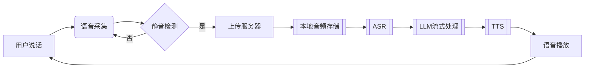

# CharacterVerse-AI

## Explanation
该项目为七牛云比赛项目，议题二。

## Question
开发一个利用 AI 来做角色扮演的网站，用户可以搜索自己感兴趣的角色例如哈利波特、苏格拉底等并可与其进行语音聊天。

请回答：

1.你计划将这个应用面向什么类型的用户？这些类型的用户他们面临什么样的痛点，你设想的用户故事是什么样呢？

2.你认为这个 APP 需要哪些功能？这些功能各自的优先级是什么？你计划本次开发哪些功能？

3.你计划采纳哪家公司的哪个 LLM 模型能力？你对比了哪些，你为什么选择用该 LLM 模型？

4.你期望 AI 角色除了语音聊天外还应该有哪些技能？

请开发以上 APP，包括实现 3 个以上 AI 角色应该具备的技能。要求不能调用第三方的 Agent 能力，只需允许调用 LLM 模型、语音识别以及 TTS 能力。针对以上 1-4 点，请把你的思考整理成文档，作为作品的说明一并提交。

## 后端项目启动 && 后端数据流图

基于Go语言开发的AI角色对话平台后端服务，提供用户管理、角色对话、语音交互等核心功能。

### 🚀 功能特性

- RESTful API 设计
- JWT鉴权与CORS支持
- 语音合成（TTS）与语音识别（ASR）服务
- 支持MySQL/PostgreSQL数据库
- 多部署方案支持（本地/Docker）

### 📦 环境要求

- Go 1.21+
- MySQL 5.7+ 或 PostgreSQL 12+
- Redis
- Docker 20.10+（可选）
- FFmpeg（语音处理依赖）

### ⚡ 快速开始

```bash
# 克隆项目
git clone xxx
cd Backend-CharacterVerse

# 安装依赖
go mod tidy

# 启动服务（开发模式）
go run main.go
```

### 🔧 配置说明

复制`.env.example`创建`.env`文件：

### 🐳 Docker部署

```dockerfile
# Dockerfile
FROM golang:1.21-alpine

WORKDIR /app
COPY . .
RUN go mod download && go build -o main .

EXPOSE 8080
CMD ["./main"]
```

```bash
# 构建镜像
docker build -t character-verse-backend .

# 运行容器
docker run -d -p 8080:8080 \
  -e APP_PORT=8080 \
  -e DB_DSN="your_db_connection_string" \
  character-verse-backend
```

### 📂 项目结构

```text
Backend-CharacterVerse/
├── api/            # API层
├── config/         # 配置加载
├── database/       # 数据库初始化
├── middleware/     # 中间件
├── model/          # 数据模型
├── router/         # 路由配置
├── service/        # 业务逻辑层
├── utils/          # 工具库
├── main.go         # 入口文件
└── go.mod          # 依赖管理
```

**（文字）聊天模块构思**

用户 发送消息给 角色
前端 -message（用户id，角色id，消息）> 后端 -> （角色的知识库（角色描述（存在MySQL角色信息里面的 Description 字段）） + message + 角色聊天的历史消息） -> 大模型 （角色的知识库 + message） -> 后端 -> （对应角色的知识库 + message + 大模型生成的回复） -> 前端

**(语音通话)聊天模块构思**

用户说话 -> 前端语音转文字（调用语音识别服务）-> 防抖（不说话的时候发送信息）-> 后端（文字聊天模块）-> message + TTS服务 -> 前端 -> 用户

**语音通话数据流（最终版）：**



## 前端项目启动 
### 🏗️ 项目概述

CharacterVerse-AI 是一个基于 React 18 + Vite 的现代化 AI 角色对话平台，支持文本聊天、语音交互、角色管理等功能。项目采用模块化架构，具有高度的可扩展性和维护性。

### 📋 技术栈

#### 核心框架
- **React 18.3.1** - 现代化前端框架，支持并发特性
- **Vite 5.4.10** - 极速构建工具，开发体验优秀
- **React Router DOM 6.30.1** - 声明式路由管理

#### UI 组件库
- **Ant Design 6.0.0-alpha.3** - 企业级 UI 设计语言
- **自定义 CSS 变量系统** - 支持主题切换和个性化定制

#### 状态管理
- **Zustand 5.0.8** - 轻量级状态管理，简单易用
- **模块化 Store 设计** - 按功能域分离状态管理

#### 网络通信
- **Axios 1.12.2** - HTTP 客户端，支持拦截器和错误处理
- **WebSocket** - 实时通信，支持流式对话

#### 音频处理
- **AudioWorklet API** - 高性能实时音频处理

### 🏛️ 项目架构

### 目录结构
```
web/
├── public/                 # 静态资源
├── src/
│   ├── assets/            # 项目资源文件
│   ├── components/        # 通用组件
│   │   ├── AuthGuard/     # 认证守卫
│   │   ├── LazyAvatar/    # 智能头像缓存组件
│   │   ├── LoginModal/    # 登录框
│   │   ├── Navigation/    # 导航组件
│   │   ├── Sidebar/       # 侧边栏
│   │   ├── ThemeController/ # 主题控制器
│   │   └── UserAvatar/    # 用户头像
│   ├── pages/             # 页面组件
│   │   ├── Home/          # 首页
│   │   ├── Chat/          # 聊天页面
│   │   ├── CharacterManagement/ # 角色管理
│   ├── router/            # 路由配置
│   ├── servers/           # API 服务层
│   ├── store/             # 全局状态管理
│   ├── styles/            # 样式文件
│   └── utils/             # 工具函数
├── package.json           # 项目配置
├── vite.config.js         # Vite 配置
└── Dockerfile            # Docker 配置
```

### #核心架构设计

#### 1. 分层架构
```
┌─────────────────┐
│   Presentation  │ ← React Components + Ant Design
├─────────────────┤
│    Business     │ ← Custom Hooks + Store (Zustand)
├─────────────────┤
│     Service     │ ← API Services + WebSocket
├─────────────────┤
│   Infrastructure│ ← Utils + Request + Audio Processing
└─────────────────┘
```

#### 2. 状态管理架构
- **useAuthStore** - 用户认证状态
- **useThemeStore** - 主题配置状态
- **useChatStore** - 聊天相关状态
- **useHomeStore** - 首页数据状态
- **useCharacterStore** - 角色管理状态

#### 3. 路由架构
- **声明式路由配置** - 集中管理所有路由
- **路由守卫** - 基于认证状态的访问控制
- **懒加载** - 按需加载页面组件，优化性能

### 🚀 启动方式

### 环境要求
- **Node.js**: 18.x (推荐 18.17.0+)
- **npm**: 9.x+ 或 **yarn**: 1.22.x+
- **现代浏览器**: Chrome 66+, Firefox 76+, Safari 14.1+

### 本地开发启动

#### 配置.env
```
# API地址
VITE_BASEURL=''
# 文件上传地址
VITE_UPLOAD_URL=''
# websocket地址
VITE_WEBSOCKET_URL=''
# 录音文件所在地址
VITE_UPVOICE_URL=''
```

#### 2. 安装依赖
```bash
cd web
npm install
```

#### 3. 启动开发服务器
```bash
npm run dev
```

#### 4. 本地访问应用
```
http://localhost:5173
```

### Docker 前端本地部署
```
FROM node:18-alpine

WORKDIR /app

# 复制package文件
COPY package*.json ./

# 安装依赖
RUN npm install

# 复制源代码
COPY . .

暴露端口
EXPOSE 5173

启动开发服务器
CMD ["npm", "run", "dev", "--", "--host", "0.0.0.0", "--port", "5173"]
```
### ✨ 项目亮点

### 1. 🎨 现代化 UI/UX 设计
- **个性化主题** - 8种预设主题色彩，支持自定义
- **高级交互语音组件** - 符合用户使用审美


### 2. 🧠 头像图片加载缓存优化
- **图片缓存优化** - 解决多组件并发请求同一图片的问题
- **请求去重机制** - 避免重复网络请求，提升性能
- **状态同步** - 多组件间实时同步缓存状态

### 3. 🎙️ 专业级音频处理，实现语音发送，语音通话功能
- **AudioWorklet 引擎** - 独立线程处理，不阻塞 UI
- **实时降噪** - 高通滤波 + 噪音门限 + 动态压缩
- **语音活动检测** - 智能识别有效语音片段
- **多设备支持** - 动态切换音频输入设备
- **低延迟处理** - 延迟低至 10ms，接近专业设备
- **为何使用AudioWorklet** - 详情可见 DEVREADME.md

### 4. ⚡ 性能优化
- **虚拟滚动加载历史消息** - 大列表性能优化

### 5. 🛠️ 开发体验，配置docker卷挂载实现实时更新
- **前后端联调** - 十分方便，无需配置环境
- **热模块替换** - 开发时实时更新，无需刷新
- **ESLint 规范** - 代码质量保证
 

## Docker本地部署启动整个项目
### 配置
参考docs下的docker-compose.yml
新建一个docker-compose.yml文件，内容如下
```
services:
  # MySQL数据库
  mysql:
    image: mysql:8.0
    container_name: characterverse-mysql
    restart: unless-stopped
    environment:
      MYSQL_ROOT_PASSWORD: 
      MYSQL_DATABASE: 
    ports:
      - "3306:3306"
    volumes:
      - mysql_data:/var/lib/mysql
    networks:
      - characterverse-network
      
  # Redis服务
  redis:
    image: redis:alpine
    container_name: characterverse-redis
    ports:
      - "6379:6379"
    volumes:
      - redis_data:/data
    command: redis-server --appendonly yes
    environment:
      - REDIS_HOST=
      - REDIS_PORT=
      - REDIS_PASSWORD=
      - REDIS_DB=
    networks:
      - characterverse-network
    restart: unless-stopped
    platform: linux/amd64

  # Go后端服务
  backend:
    build:
      context: ../server/Backend-CharacterVerse
      dockerfile: Dockerfile.dev
    container_name: characterverse-backend
    restart: unless-stopped
    ports:
      - "8080:8080"
    volumes:
      - ../server/Backend-CharacterVerse:/app
    environment:
      - DB_HOST=
      - DB_PORT=
      - DB_USER=
      - DB_PASSWORD=
      - DB_NAME=
      - JWT_SECRET=
      - QINIU_API_KEY=
      - QINIU_MODEL_NAME=
      - REDIS_HOST=
      - REDIS_PORT=
      - REDIS_PASSWORD=
      - REDIS_DB=
    depends_on:
      - mysql
      - redis
    networks:
      - characterverse-network

  # React前端服务
  frontend:
    build:
      context: ../web
      dockerfile: Dockerfile
    container_name: characterverse-frontend
    restart: unless-stopped
    ports:
      - "5173:5173"
    volumes:
      - ../web:/app
      - /app/node_modules
    depends_on:
      - backend
    networks:
      - characterverse-network

volumes:
  mysql_data:
  redis_data:

networks:
  characterverse-network:
    driver: bridge
```

```
cd docs
docker-compose up
```
