```mermaid
graph LR
    A[用户说话] --> B(语音采集)
    B --> C{静音检测}
    C -->|是| D[上传服务器]
    C -->|否| B
    D --> E[[本地音频存储]]
    E --> F[[ASR]]
    F --> G[[LLM流式处理]]
    G --> H[[TTS]]
    H --> I[语音播放]
    I --> A

```

# CharacterVerse-AI

## Explanation
该项目为七牛云比赛项目，议题二。

## Question
开发一个利用 AI 来做角色扮演的网站，用户可以搜索自己感兴趣的角色例如哈利波特、苏格拉底等并可与其进行语音聊天。

请回答：

1.你计划将这个应用面向什么类型的用户？这些类型的用户他们面临什么样的痛点，你设想的用户故事是什么样呢？

2.你认为这个 APP 需要哪些功能？这些功能各自的优先级是什么？你计划本次开发哪些功能？

3.你计划采纳哪家公司的哪个 LLM 模型能力？你对比了哪些，你为什么选择用该 LLM 模型？

4.你期望 AI 角色除了语音聊天外还应该有哪些技能？

请开发以上 APP，包括实现 3 个以上 AI 角色应该具备的技能。要求不能调用第三方的 Agent 能力，只需允许调用 LLM 模型、语音识别以及 TTS 能力。针对以上 1-4 点，请把你的思考整理成文档，作为作品的说明一并提交。

## 后端项目启动 && 后端数据流图

基于Go语言开发的AI角色对话平台后端服务，提供用户管理、角色对话、语音交互等核心功能。

## 🚀 功能特性

- RESTful API 设计
- JWT鉴权与CORS支持
- 语音合成（TTS）与语音识别（ASR）服务
- 支持MySQL/PostgreSQL数据库
- 多部署方案支持（本地/Docker）

## 📦 环境要求

- Go 1.21+
- MySQL 5.7+ 或 PostgreSQL 12+
- Redis
- Docker 20.10+（可选）
- FFmpeg（语音处理依赖）

## ⚡ 快速开始

```bash
# 克隆项目
git clone xxx
cd Backend-CharacterVerse

# 安装依赖
go mod tidy

# 启动服务（开发模式）
go run main.go
```

## 🔧 配置说明

复制`.env.example`创建`.env`文件：

## 🐳 Docker部署

```dockerfile
# Dockerfile
FROM golang:1.21-alpine

WORKDIR /app
COPY . .
RUN go mod download && go build -o main .

EXPOSE 8080
CMD ["./main"]
```

```bash
# 构建镜像
docker build -t character-verse-backend .

# 运行容器
docker run -d -p 8080:8080 \
  -e APP_PORT=8080 \
  -e DB_DSN="your_db_connection_string" \
  character-verse-backend
```

## 📂 项目结构

```text
Backend-CharacterVerse/
├── api/            # API层
├── config/         # 配置加载
├── database/       # 数据库初始化
├── middleware/     # 中间件
├── model/          # 数据模型
├── router/         # 路由配置
├── service/        # 业务逻辑层
├── utils/          # 工具库
├── main.go         # 入口文件
└── go.mod          # 依赖管理
```
语音通话数据流（最终版）：


