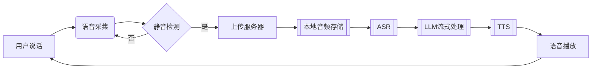

# CharacterVerse 后端服务

基于Go语言开发的AI角色对话平台后端服务，提供用户管理、角色对话、语音交互等核心功能。

## 🚀 功能特性
- RESTful API 设计
- JWT鉴权与CORS支持
- 语音合成（TTS）与语音识别（ASR）服务
- 支持MySQL/PostgreSQL数据库
- 多部署方案支持（本地/Docker）

## 📦 环境要求
- Go 1.21+
- MySQL 5.7+ 或 PostgreSQL 12+
- Redis
- Docker 20.10+（可选）
- FFmpeg（语音处理依赖）

## ⚡ 快速开始
```bash
# 克隆项目
git clone xxx
cd Backend-CharacterVerse

# 安装依赖
go mod tidy

# 启动服务（开发模式）
go run main.go
```

## 🔧 配置说明

复制`.env.example`创建`.env`文件：

## 🐳 Docker部署
```dockerfile
# Dockerfile
FROM golang:1.21-alpine

WORKDIR /app
COPY . .
RUN go mod download && go build -o main .

EXPOSE 8080
CMD ["./main"]
```

```bash
# 构建镜像
docker build -t character-verse-backend .

# 运行容器
docker run -d -p 8080:8080 \
  -e APP_PORT=8080 \
  -e DB_DSN="your_db_connection_string" \
  character-verse-backend
```

## 📂 项目结构
```text
Backend-CharacterVerse/
├── api/            # API层
├── config/         # 配置加载
├── database/       # 数据库初始化
├── middleware/     # 中间件
├── model/          # 数据模型
├── router/         # 路由配置
├── service/        # 业务逻辑层
├── utils/          # 工具库
├── main.go         # 入口文件
└── go.mod          # 依赖管理
```


语音通话数据流（最终版）：


